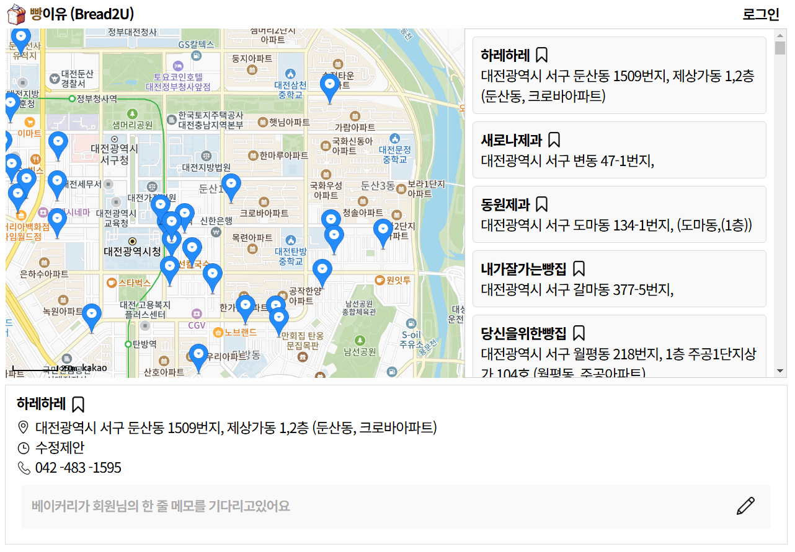
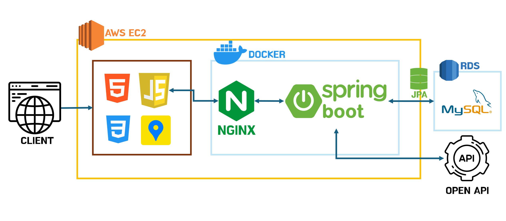

## 빵이유(Bread2U)

<b>개발기간</b> 2024.12.17 ~ 2024.12.22
 <b>개발자</b> 권예지(mylazysundaycat)
 대전광역시 제과점 정보를 OPEN API로 연동하고, 이를 카카오 맵 API를 활용하여 시각화했습니다. 
사용자는 방문한 제과점들을 북마크 하며 '대전 빵집 도장깨기' 경험을 할 수 있습니다.

### Trouble Shooting
[#46 회원의 베이커리 북마크 추가 시 무한 추가되는 오류](https://github.com/users/mylazysundaycat/projects/3?pane=issue&itemId=91496282&issue=mylazysundaycat%7Cbread2u%7C46)
 [#42 제과점 OPEN API 중복 데이터 문제](https://github.com/users/mylazysundaycat/projects/3/views/1?pane=issue&itemId=91447981&issue=mylazysundaycat%7Cbread2u%7C42)
 [#57 EC2 서버 구축 이후 API 요청 에러](https://github.com/users/mylazysundaycat/projects/3/views/1?pane=issue&itemId=91707833&issue=mylazysundaycat%7Cbread2u%7C57)
 [#58 Unexpected token '<', "<!DOCTYPE " 에러](https://github.com/users/mylazysundaycat/projects/3/views/1?pane=issue&itemId=91889551&issue=mylazysundaycat%7Cbread2u%7C58)
### Project Architecture

### Stack

Backend 

      

DB 
 

CI/CD 
 

